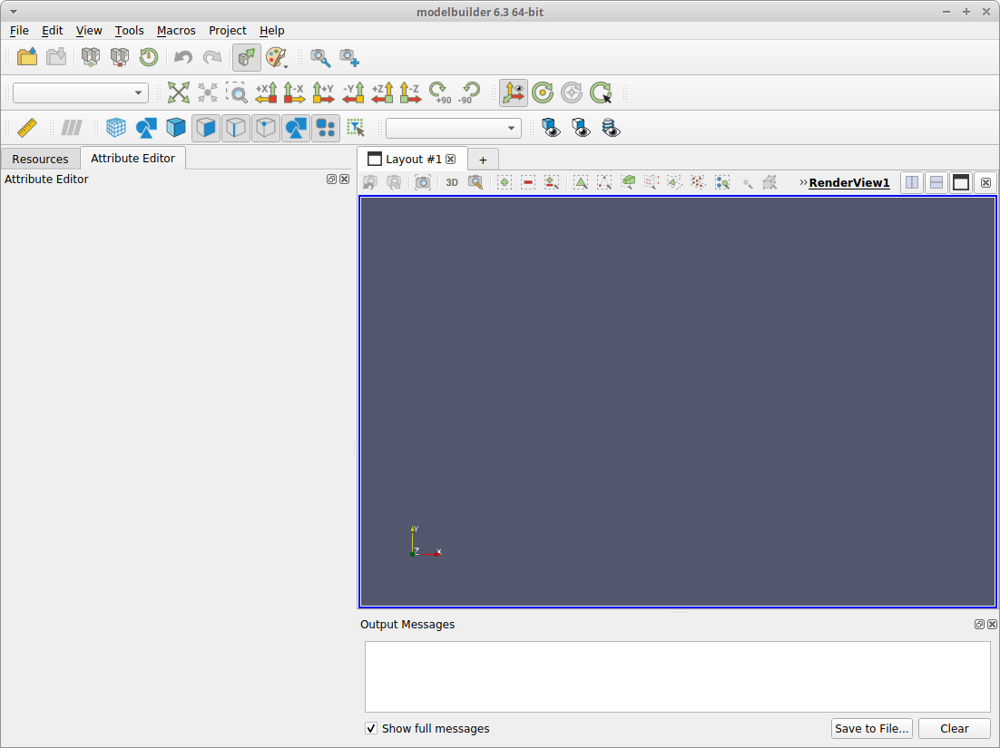

# Using projects in modelbuilder

The "Projects" menu was added to modelbuilder in 2019 to facilitate the
management of simulation assets.

Before starting, make sure you have completed the platform-specific install
instructions in the linuxInstall.md, macosInstall.md, or windowsInstall.md
file. In particular, be sure you have (i) set the smtkProjectManagerPlugin
to load automatically, (ii) set the smtkTruchasPlugin to load automatically,
and (iii) configured the applications settings/preferences "Workflows Folder"
item.

## Initial View Setup

When first starting the application, a number of view panels appear on the left-
hand side of the application. Each panel is a Dock Widget that can be closed or
undocked in the same way that ParaView panels work. For simulation preprocessing,
the following setup is recommended, although users can chose whatever
configuration they prefer:

* Close the Properties and Operations panels
* This should leave 2 view panels: Attribute Editor and Resources.
* Undock the Resources view and drag it over the Attribute Editor view,
  so that it docks as a second tab.
* Drag the left-hand panel so that it occupies approximately 1/3 of the
  widown size. You can change any of the fields as preferred.
* Select the Attributes view (tab).

This recommended configuration looks like the following:

## Creating a Project

From the Project menu, select "New Project...", which brings up a dialog window
for creating or selecting the directory for storing project files.

* This first dialog will start in the "Projects Roots Folder" if that has been
  defined in the application settings, otherwise it starts in the current
  working directory.
* In this dialog, you cannot enter text to create a directory. Instead, you can
  create directories by clicking the folder icon near the upper right corner
  of the dialog.
* After a directory is selected, modelbuilder will display a warning popup if the
  selected directory contains files or subdirectories. You are then given the
  option to (i) continue, in which case modelbuilder deletes all of the current
  directory contents, (ii) cancel the new-project action, or (iii) select a
  different directory.
* After the directory is selected, modelbuilder displays a "New Project"
  dialog with the project name filled in. If things have been configured
  correctly, you should only need to enter a "Geometry File", which can be
  a Genesis, Exodus, or NetCDF file.

After entering the geometry file, click the "Apply" button and the project is
project is created and its contents displayed in modelbuilder. On some systems,
the geometry file does not immediately display; if that happens, try switching
from the Attributes tab to the Resources tab and back.

Once the model appears in the 3D view, is it important to SAVE THE PROJECT WHEN
IT IS FIRST CREATED. This is because, at present, the contents of the attribute
resource is typically modified when first displayed in modelbuilder. To save the
project, use the "Save Project" menu item in the "Project" menu.

At this point, you can select the "Attribute Editor" view (tab) and begin
defining the simulation attributes with the same UI as in previous versions of
modelbuilder. When you have completed defining the simulation, be sure to save
the project again.

## Writing Solver Input

To generate the solver file, use the "Project Export" item in the "Project" menu,
which brings up a dialog window. The dialog should enter default values for each
field, although you are free to change them as desired. Click the "Apply" button
to write the input file to the local project directory.

## Saving Projects

Be sure to use the "Project Save" item after making changes to the simulation
attributes.
